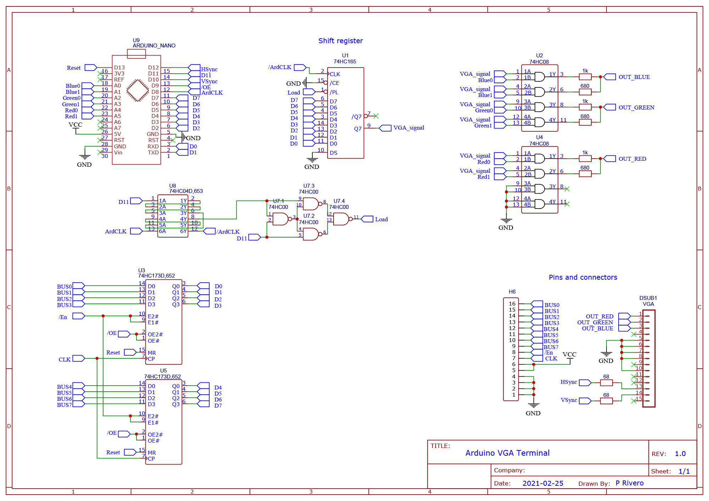

# Arduino VGA Terminal

Use an Arduino Nano as a terminal for your homebrew computer
- VGA video output of 320x480 pixels at 60 Hz 
- 25 lines of text with 40 text characters each, on an 8x8 pixel font

Adapted from https://github.com/slu4coder/ArduinoVGA

The terminal supports 6-bit color output (2 bits per RGB channel), for a total of 64 colors.

**Guide of available colors:**

> **Example:** Calling `SetColor(LIGHTLIME)` will set the current line color to `#aaff55`, and calling `SetColor(DDARKBLUE)` will set the current line color to `#000055`.

## How to compile:

**For an Ardiuno Nano:**

You could use the Arduino IDE, but in my case it caused extreme flickering and instablilty. Instead, I recommend:
- Set Arduino Nano FuseA from default 0xFF to 0xBF. [See original video](https://youtu.be/Id3VYybrcws?t=269).
- Install `gcc-avr` using `sudo apt install gcc-avr`.
- Install the required libraries using `sudo apt install avr-libc`.
- Install `avrdude`.
    - If you are using native Linux, use `sudo apt install avrdude`.
    - If you are using Windows WSL2, it *cannot* access COM ports. [Download WinAVR](https://sourceforge.net/projects/winavr/) and call `avrdude` from `CMD`.
- Compile and send the program using the makefile (`make send`). If you are using native Linux, you will need to modify the makefile slightly ([line 7](https://github.com/p-rivero/ArduinoVGA/blob/main/makefile#L7)).

**For an ATmega328P:**

I used the *Minipro/XGecu TL866II Plus* programmer with the provided Windows software (Xgpro v10.37). If your programmer is different, some steps may vary.
- Install `gcc-avr` using `sudo apt install gcc-avr`.
- Install the required libraries using `sudo apt install avr-libc`.
- Compile the program using the makefile (`make compile`).
- On the programmer software, press *Select IC* and choose *ATMEGA328P @DIP28* **[1]**.
- Load the hex file (`VGA_Terminal.hex`) **[2]**. Navigate to the *Device Info* **[3]** tab and select the fuse bits indicated below **[4]** *(remember that checked bits are programmed as LOW)*.
- Insert the ATmega328P in the ZIF socket and press *Program* **[5]**.

## Required hardware:

- The ICs used in [the original video series](https://youtu.be/jUoR5ICCepA)
- 2 x 74HC08
- 3 x 680 Ohm resistor
- 3 x 1 KOhm resistor

Connect the 6 color bits to pins A0-A5, as indicated in the schematic:

## Demo:

**Note:** The current version of the terminal (`main` branch) has a different text. This image corresponds to the `6-bit-color` branch.

